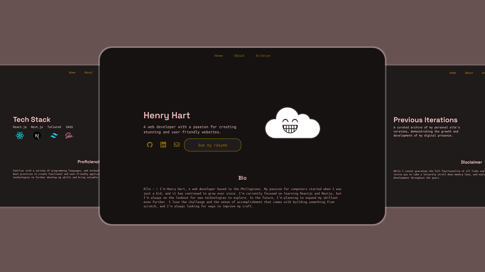

# ☁ Personal Site 2023 version 2

A personal site that serves as a showcase for my web development skills developed over the years. This project will sort of be my pet project when I learn new concepts in web development and implement it here first.

## 🤝 Credit

Crediting these developers for giving me inspiration in their personal sites and using their design for my own personal site.

- [Afn](https://github.com/xafn) - design for the site.
- [Lynn Fisher](https://github.com/lynnandtonic) - the whole concept of making a yearly personal site and the archiving page.

## 📝 To add

Features that I want to add in this project or the following iteration of the project.

1. Blogging
2. CMS

## ⚙️ Installation 

The project is built by Next.js.

1. `npm install`
2. `npm run dev`

